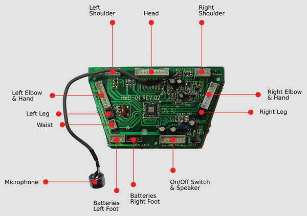

## Arduino®-compatible LEDuino running an autonomous Robosapien robot!
## https://cal-eng.com/?page_id=681

## Anatomy of Robosapien
## https://www.raspberry-pi-geek.com/Archive/2015/09/Bring-old-toys-back-to-life-with-Arduino

## RoboSapienIR – use the RoboSapien with an Arduino
## https://blog.adafruit.com/2011/11/08/robosapienir-use-the-robosapien-with-an-arduino/
## https://playground.arduino.cc/Main/RoboSapienIR/

## Tweetosapien: Hack a Robosapien With Arduino to React to Tweets
## https://makezine.com/2013/06/03/tweetosapien-hack-a-robosapien-with-arduino-to-react-to-tweets/

## Robosapien Hacks
## https://www.pinterest.ca/randellrl1/robosapien-hacks/

## robosapien and arduino
## https://playground.arduino.cc/Main/RoboSapienIR/

## hack-a-robosapien
## https://code.google.com/archive/p/hack-a-robosapien/

## 
## https://hackaday.com/2021/09/07/pandemic-gives-passersby-a-window-on-cyborg-control/

## RoboSapien IR Codes
## https://www.markcra.com/robot/ir_codes.php
